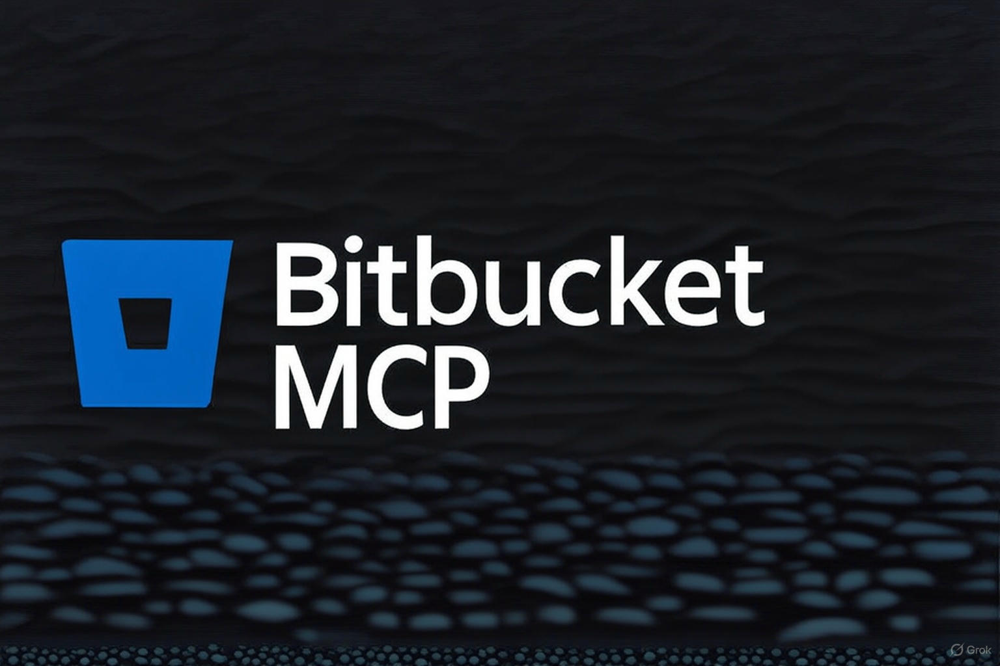

# Bitbucket MCP Server


A Model Context Protocol (MCP) server that provides tools for interacting with Bitbucket repositories, pull requests, issues, and more.

## Quick Start

1. **Install and Build:**
   ```bash
   npm install
   npm run build
   ```

2. **Configure Environment:**
   Set the required variables (see [Configuration](#configuration)):
   ```bash
   export BITBUCKET_API_TOKEN="your-api-token"
   export BITBUCKET_USERNAME="your-email@example.com"
   ```

3. **Run the Server:**
   ```bash
   npm start
   ```

## Features

This MCP server provides comprehensive tools for Bitbucket integration:

- **Repository Management**: List and inspect repositories in a workspace.
- **Pull Requests**: Full lifecycle support—list, get details, create, update, diff, and comment.
- **Issues**: Query and filter repository issues.
- **Source Code**: Explore branches and commits.
- **System & Search**: Cross-resource search and health monitoring.

For a full list of available tools and their parameters, see the [Tool Reference](docs/TOOLS.md).

## Installation

1. Clone or download this repository.
2. Install dependencies:
   ```bash
   npm install
   ```
3. Build the project:
   ```bash
   npm run build
   ```

## Configuration

The server is configured via environment variables. For detailed setup instructions and client-specific examples (Claude Desktop, etc.), please refer to the [Configuration Guide](CONFIGURATION.md).

### Essential Variables

| Variable | Description |
|---|---|
| `BITBUCKET_API_TOKEN` | **(Required)** Your User API token or Workspace/Project token |
| `BITBUCKET_USERNAME` | **(Required for User API tokens)** Your Atlassian account email |
| `BITBUCKET_WORKSPACE` | Default workspace used when the parameter is omitted |

> **Note:** If you are using a Workspace or Project access token, you can omit `BITBUCKET_USERNAME`.

### Advanced Settings

Additional configuration options for timeouts, caching, metrics, and retries are documented in [CONFIGURATION.md](CONFIGURATION.md#optional-settings).

## MCP Client Configuration

Add this server to your MCP client configuration (e.g., `claude_desktop_config.json`). See [CONFIGURATION.md](CONFIGURATION.md#mcp-client-configuration) for full examples for macOS, Linux, and Windows.

```json
{
  "mcpServers": {
    "bitbucket-mcp": {
      "command": "node",
      "args": ["/ABSOLUTE/PATH/TO/bitbucket_mcp/build/index.js"],
      "env": {
        "BITBUCKET_USERNAME": "your-email@example.com",
        "BITBUCKET_API_TOKEN": "your-api-token",
        "BITBUCKET_WORKSPACE": "your-workspace"
      }
    }
  }
}
```

## Usage Examples

### List Repositories
```
List all repositories in the 'myworkspace' workspace
```

### Create Pull Request
```
Create a pull request from feature/my-feature to main in myworkspace/myrepo with title "My Feature PR"
```

### Search Workspace
```
Search for "authentication" across all repositories and pull requests
```

See more examples for PRs, issues, and commits in the [Tool Reference](docs/TOOLS.md).

## Development

- **Build**: `npm run build`
- **Dev Mode**: `npm run dev`
- **Test**: `npm test`
- **Coverage**: `npm run test:coverage`

## Troubleshooting

Refer to the [Troubleshooting section in CONFIGURATION.md](CONFIGURATION.md#troubleshooting) for common issues related to authentication, permissions, and rate limiting.

## License

ISC

## Contributing

Contributions are welcome! Please feel free to submit issues and pull requests.
